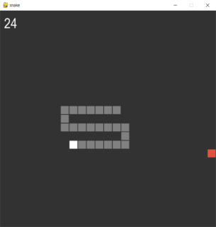

[ARCHIVE PROJECT @ 2019]

**SNAKE 🐍** \
*Author:* **Konrad Ceglarski** \
*Description [PL]:* Gra polega na zjadaniu jabłek, które zwiększają długość węża - co utrudnia poruszanie się po planszy.

*Notes [PL]:*
Zalecane jest używanie Windows'a 10, gdyż aplikacja była pisana z myślą o tym systemie. \
Prosta, ale kultowa gra odtworzona przeze mnie przy użyciu języka **Python 3 (3.6.8+)** oraz modułu **pygame (1.9.6+)**. \
Program uruchamiany poprzez pliki *"start.bat"* lub *"main.py"*. \
Program można także uruchomić przez konsolę poleceniem - `python3 main.py` lub `py main.py`.
Dzięki takiemu uruchomieniu mamy możliwość na customizację gry, gdyż przyjmuje ona 4 kolejne argumenty:

*Arguments:*
| OPIS ARGUMENTU | ZAKRES | DEFAULT |
| -------------- | ------ | ------- |
| Wymiar planszy | 10 - 30 | 25 |
| Skalę, czyli rozmiar pól | 20 - 40 | 25 |
| Ilość klatek na sekundę | niesprecyzowano zakresu | 15 |
| Bariery | `true` lub `false` |  false |

*Controls:*
| KLAWISZ | AKCJA |
| ------- | ----- |
| <kbd>W</kbd> <kbd>A</kbd> <kbd>S</kbd> <kbd>D</kbd> lub <kbd>&uarr;</kbd> <kbd>&larr;</kbd> <kbd>&darr;</kbd> <kbd>&rarr;</kbd> | Ustawianie kierunku poruszania się węża |
| <kbd>SPACJA</kbd>	| Pauza |
| <kbd>ESC</kbd> | Wyjscie z aplikacji |
| <kbd>R</kbd> | Restart po przegranej |

*Preview:* \

